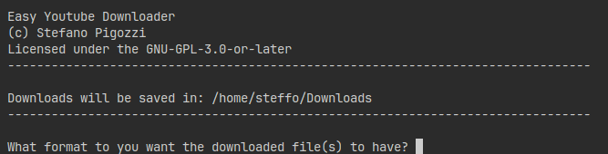

<div align="center">


# youtubedlez

Simple interface for [`yt-dlp`](https://github.com/yt-dlp/yt-dlp)

</div>

## Links

[](https://pypi.org/project/youtubedlez)

## Installation

```
pipx install youtubedlez
```

## Usage

```
youtubedlez
```

## Screenshot


